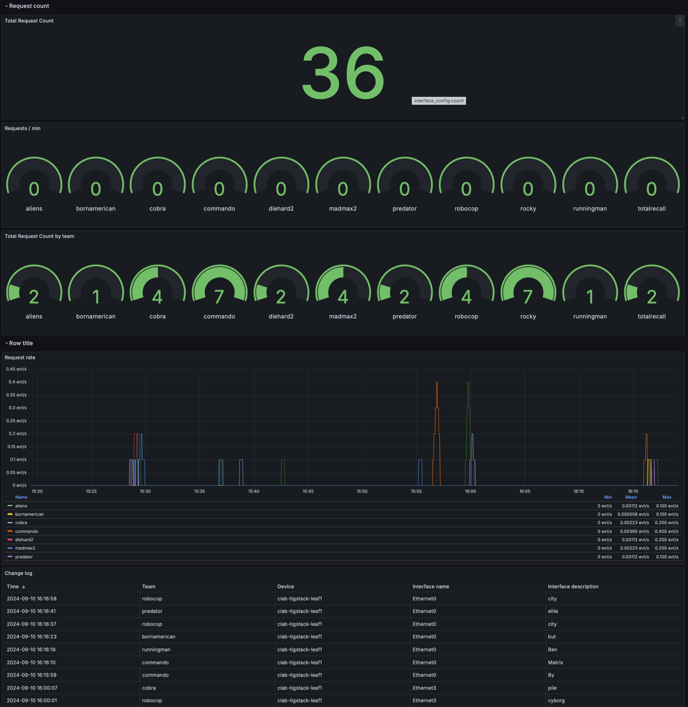

# Competition

This is a proposal for a friendly competition between the participants.

The purpose of the game is to change the interface description of the Dell Sonic switch(es) based on the given words as fast as possible. This can be done by using various tools presented earlier

* CLI
    * netmiko
    * scrapli
    * paramiko
* restconf
* gnmi
* ansible
* nornir
* bash/curl

## Rules 

* each team selects a short plot of their favourite movie in 56 words, i.e the same number as interfaces on the Sonic switch.
* you get points by changing the interface description
* interface description can be only changed if the value is different that the value you are changing it to, i.e. only the changed description counts
    * the points are calculated with gnmi subscription with 'on_change'
* if the interface description is changed to wrong value, point is given to some other team randomly

